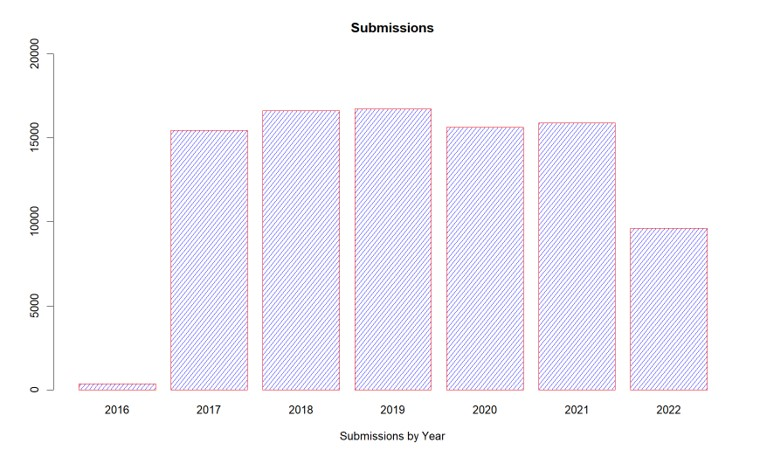
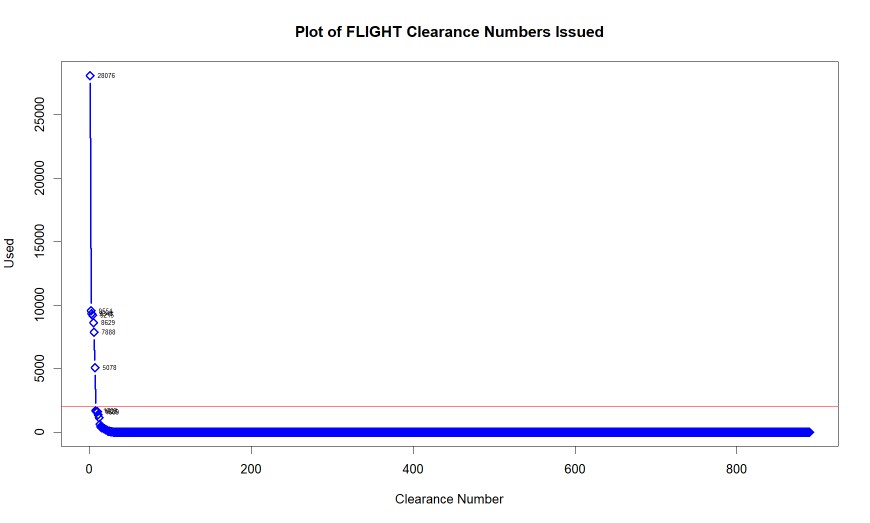
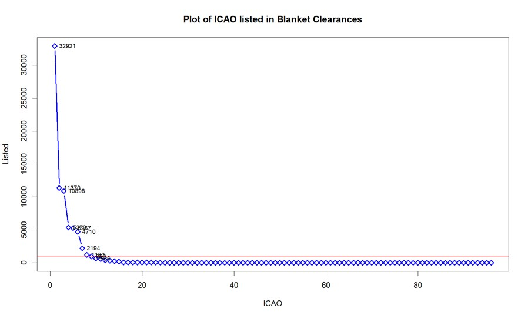
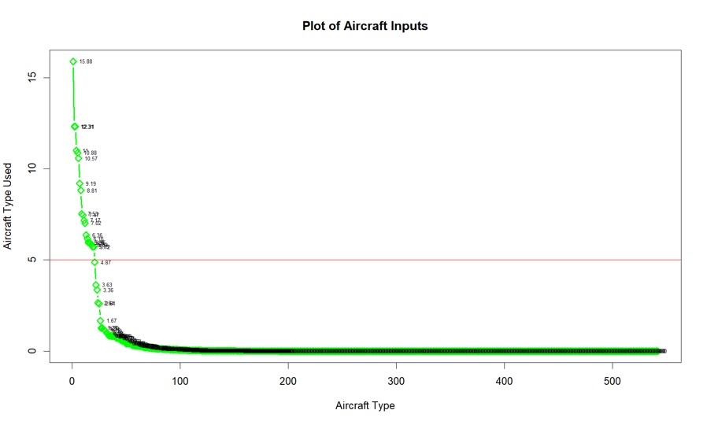

  
  
  

  
## **Aircraft Flight Clearance Study-- Descriptive Analysis for Automation**

&nbsp;

&nbsp;

{width=100%}

&nbsp;

[Source Code](Flight_Study.html)

&nbsp;

  
##### **I conducted this descriptive analysis as a side project while working at the U.S. Embassy in Berlin, Germany. The goal was to find association within historical data to automate flight clearance requests between governments.**

&nbsp;

##### **Purpose**
  + The purpose of this project I led was to analyze historical flight request data to identify associations and determine filtering attributes for automation of requests. One parameter of this request was to only submit the most impactful associations for maximum auto-approval.  This was due to the limited time and resources the software center could put toward auto-approving complicated requests. 

##### **Abstract**
  + All developed countries require coordination and approval of any foreign aircraft that wishes to fly in that countries airspace. Sometimes this requires diplomatic action between foreign embassies and host nation ministries to work through some of these approvals. Lately, host nations have put trust in foreign embassies to approve these aircraft submissions internally which has eliminated unnecessary official engagement at host nation government offices. These requests are submitted using a web based software product where each request must be evaluated and approved or coordinated if necessary. This software package has an auto function that allows for instantaneous approval if certain criteria is met. Depending on the diplomatic agreements between foreign and host nation government, it can often be difficult to use this function.

##### **Origin of Data**
  +  The data I analyzed had 90k observations and nine attributes (two ordinal and seven categorical). Analysis is supported using R Suite with data visualizations to explain the methodologies.

##### **Preparation of Data**
  + Little preparation was needed to analyze the data. First I adjusted the attribute names to simplify the titles. Then I simply removed the empty spaces in the clearance and airport code inputs and converting everything to uppercase for grouping of data. For ease, I created a separate attribute for the year and for the month and year in preperation of the analysis.

##### **Analysis of Data**
  + First, I determine the total number of submissions by year and the frequency each year of which each clearance number appears. In this analysis, it was important to know where a data point’s relative costs to increase some tunable parameter is no longer worth the corresponding performance benefit. The algorithm “Kneedle” detects those beneficial data points showing the best balance inherent tradeoffs called elbows in this case where the curve that has positive concavity in this discrete dataset. Within this data, it was easy to visually determine that for the clearance number that the threshold was anything over 2000 submissions.  I applied the same method for determining airport code at 1000 observations, and aircraft type greater than 5%.  

  + Determining aircraft type proved to be the more challenging of the attributes to determine.  This input from each submitter is an open field so there was many different variations of the same type of aircraft.  To narrow down this attribute, I transformed the field into a term document matrix to aid in grouping of aircraft types. After studying aircraft types, I could transform and remove input details like model type of aircraft year as this had no bearing on the flight clearance.  Using a For loop, I counted appearances of each word in the term document matrix.  This narrowed down the aircraft to 22 different types when after reviewing the final batch, I was able to eliminate 13 of the types due to duplication.
 
  + The embassy wanted visibility of any flights that may have a VIP on board, so I filter the purpose of each flight to not auto-approve those flights with VIP’s on board.  The final attribute was binary. Each flight is identified as having hazardous cargo or not. The embassy chose to have visibility of any flight with hazardous cargo. 

##### **Conclusion**
  + My descriptive analysis concluded that the combination of eight different aircraft types combined with eight different airport or no airport types would yield significant results in this study. My analysis showed that by implementing a code evaluating each submission for 64 different conditional statements, the embassy could auto-approve on average 63% of all flight request submissions.  

 	Year	All	    Selected	Percent
1	2016	372	    161	        43.28
2	2017	15454	  9455	      61.18
3	2018	16603	  10707	      64.49
4	2019	16702	  11019	      65.97
5	2020	15629	  9213	      58.95
6	2021	15874	  10856	      68.39
7	2022	9625	  6132	      63.71
TOTAL	 	90259	  57543	 
AVG	 	16052.4	  10250	      63.78

&nbsp;

&nbsp;

&nbsp;

&nbsp;

&nbsp;

&nbsp;

&nbsp;

&nbsp;

&nbsp;

{width=95%}

&nbsp;

&nbsp;

{width=95%}

&nbsp;

&nbsp;

{width=95%}

&nbsp;

&nbsp;

{width=95%}

