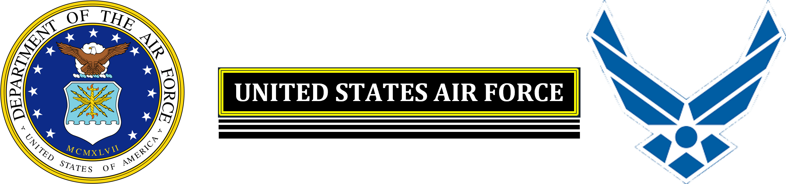
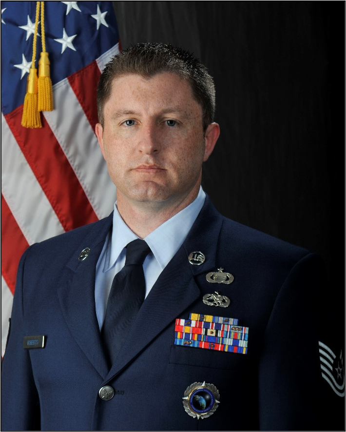

```{=html}
<style type="text/css">
  .title {
    display: none;
  }

getting-started img {
  margin-right: 10px;
}

</style>
```
<div class="row" style="padding-top: 30px;">

<p> </p>

<center>{width="80%"}</center>

<p> </p>
<center>
### **MASTER SERGEANT KEVIN A ROBERTS**
#### *OFFICIAL MILITARY BIOGRAPHY*
</center>
</div>
<div class="col-md-4">
<p> </p>
<center>{width="90%"}</center>

</div>
<div class="col-md-8">
<p> </p>

Master Sergeant Kevin A. Roberts serves as the Operations Senior Non-Commissioned Officer in the U.S. Defense Attaché Office at the U.S. Embassy in Berlin, Germany. In this capacity, MSgt Roberts was the principal operational advisor to the Senior Defense Official to Germany and director of a 19-person senior military team. He was responsible for delegating tasks, managing budgets, assessing workforce performance, and devising strategies to optimize the department of defense diplomatic activities in Germany. MSgt Roberts leveraged a developmental approach to managing a team of 19, collaboratively identifying and implementing training and growth opportunities to help further his team members' careers.

MSgt Roberts entered the Air Force in March 2002. He graduated from the Aerospace Ground Equipment Technician Course at Sheppard Air Force Base, Texas in October 2002. After serving nine years as an Aerospace Equipment Craftsman, the Air Force approved MSgt Roberts to fill a critical role as a Geospatial Intelligence Analyst. In October of 2011, he graduated from the Geospatial Intelligence Course at Goodfellow Air Force Base, Texas. In 2017, MSgt Roberts was selected for a special assignment to the Defense Attaché Office at the U.S. Embassy Kabul, Afghanistan. His background includes various leadership and management duties as an Aerospace Equipment Craftsman at the unit and group-command level. He has served in multiple positions as a Geospatial Analyst in the Air Force Distributed Common Ground System, Air Force Research Laboratory Directorate, and in a joint command at the National Geospatial-Intelligence Agency. Throughout his career, he has filled a myriad of additional roles including, Transient Alert, Quality Assurance Inspector, Hazardous Waste Manager, MC-12 Mission Manager, Physical Training Leader, Unit Training Manager, Assistant First Sergeant, and as a reports officer.

</div>
<div class="col-md-12">
<p> </p>

#### *ASSIGNMENTS*

1.  March 2002 -- April 2002, Student, Basic Military Training, Lackland AFB, Texas
2.  April 2002 -- October 2002, Student, Aerospace Ground Equipment Technical Training, Sheppard AFB, Texas
3.  October 2002 -- October 2005, Aerospace Ground Equipment Apprentice, Royal AFB Mildenhall UK
4.  October 2005 -- September 2007, Aerospace Ground Equipment Technician, Mountain Home AFB, Idaho
5.  September 2007 -- February 2008, Transient Alert Maintenance Supervisor, Kirkuk AB, Iraq
6.  February 2008 -- June 2010, Quality Assurance Inspector, Mountain Home AFB, Idaho
7.  June 2010 -- March 2011, Aerospace Ground Equipment Flight Hazardous Waste Manager, Mountain Home, Idaho
8.  March 2011 -- October 2011, Student, Imagery Analyst School, Goodfellow AFB, Texas
9.  October 2011 -- June 2012, Geospatial Analyst, DCGS-2 Beale AFB, California
10. June 2012 -- January 2014, Research and Development Imagery Analyst, Air Force Research Laboratory Rome, New York
11. January 2014 -- January 2016, Geospatial Analyst, National Geospatial-Intelligence Agency Support Team to Defense Intelligence Agency, Joint Base Anacostia-Bolling, Washington D.C.
12. January 2016 -- January 2018, NCOIC Precision Engagement Division, National Geospatial-Intelligence Agency, Springfield Virginia
13. January 2018 -- July 2018, Joint Military Attaché School, Defense Intelligence Agency, Joint Base Anacostia-Bolling, Washington D.C.
14. July 2018 -- July 2019, U.S. Defense Attaché Office, U.S. Embassy Kabul, Afghanistan
15. July 2019 -- July 2020, Student, Defense Language Institute, Washington D.C.
16. July 2020 -- July 2023, U.S. Defense Attaché Office, U.S. Embassy Berlin, Germany

<p> </p>
#### *EFFECTIVE DATES OF PROMOTION*

-   Airman Basic March 5, 2002
-   Airman First Class April 19, 2002
-   Senior Airman August 19, 2004
-   Staff Sergeant June 01, 2006
-   Technical Sergeant January 01, 2012
-   Master Sergeant September 01, 2018

<p> </p>
#### *EDUCATION*

-   2002 Basic Military Training, Lackland AFB, Texas
-   2002 Aerospace Ground Equipment School
-   2005 Associate of Science Degree Aerospace Science, Community College of the Air Force
-   2006 Airmen Leadership School, Mountain Home AFB, Idaho
-   2011 Imagery Analyst School, Goodfellow AFB, Texas
-   2012 Associate of Science Degree Intelligence Studies and Technology, Community College of the Air Force
-   2015 Non-Commissioned Officer Academy, Tyson-McGhee Air National Guard Base, Tennessee
-   2018 Joint Military Attaché School, Defense Intelligence Agency, Joint Base Anacostia-Bolling, Washington D.C.
-   2018 Bachelor's Degree, Computer Information System Management, Park University Missouri
-   2018 Associate of Arts Degree Human Resources, Community College of the Air Force
-   2022 Graduate Certificate, Data Analytics, Boston University Massachusetts

</div>
<div class="col-md-6">

<p> </p>
#### *MAJOR AWARDS AND DECORATIONS*

-   Humanitarian Service Medal Air Force
-   Air Force Achievement Medal with oak leaf cluster
-   Air Force Commendation Medal with oak leaf cluster
-   Joint Service Achievement Medal
-   Joint Service Commendation Medal
-   Defense Meritorious Service Medal with two oak leaf clusters

</div>
<div class="col-md-6">

<p> </p>
<left>{width="60%"}</left>

</div>
<div class="col-md-12">

<p> </p>
#### *OTHER ACHIEVEMENTS*

-   2007 ACC Leo Marquez Maintainer of the Year Award
-   2015 Distinguished Graduate, Non-Commissioned Officer Academy
-   2022 Department of State Superior Service Award

<p> </p>
(Current as of December 2022)


