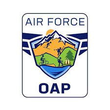
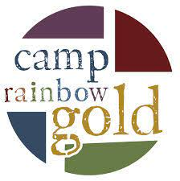
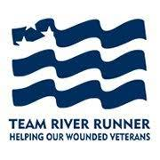

  

  

  
## **Volunteerism**

&nbsp;

&nbsp;

#### *Camp Rainbow Gold*

Serving Idaho children diagnosed with cancer and their families.Our mission is to provide emotionally empowering experiences to Idaho children diagnosed with cancer and their families. Click here to learn more about who we are and what we do.

Participating Years: 2009-2010 and 2017

Position: Camp Counselor

&nbsp;

&nbsp;

&nbsp;

&nbsp;

&nbsp;

{width=80%}

&nbsp;

&nbsp;

&nbsp;

&nbsp;

&nbsp;

&nbsp;

### *Team River Runner*

To provide all veterans and their families an opportunity to find health, healing, community purpose, and new challenges through adventure and adaptive paddle sports!

Participating Years: 2017-2021

Position: Kayak Instructor, Trip Leader, Event Coordinator

{width=60%}

&nbsp;

&nbsp;

### *Outdoor Adventure Program*

Outdoor Recreation offers exciting, year-round, high-adventure programming for Gunfighters and their families.

Idaho provides a dramatic backdrop for trips ranging from white water rafting and kayaking to cross-country skiing and snowmobiling. We offer mountain biking, hiking, horseback riding, rock hounding, gold panning, backpacking, Yellowstone snowmobiling, snowshoeing and more. Visit our website often or contact our staff about upcoming trips, costs, and dates.

Idaho has some of the best whitewater rafting in the world. We offer a volunteer boatman program where participants attend meetings and training throughout the spring, then, after successfully completing training, become boat captains for summer trips.

Participating Years: 2007 - 2011

Position: Whitewater Rafting Guide, Whitewater Kayak Guide, Yellowstone National Park Snowmobile Guide

Honored with Volunteer of the Year for 2008-2009

&nbsp;

{width=60%}

    
  
  
  
  
  
  
  

