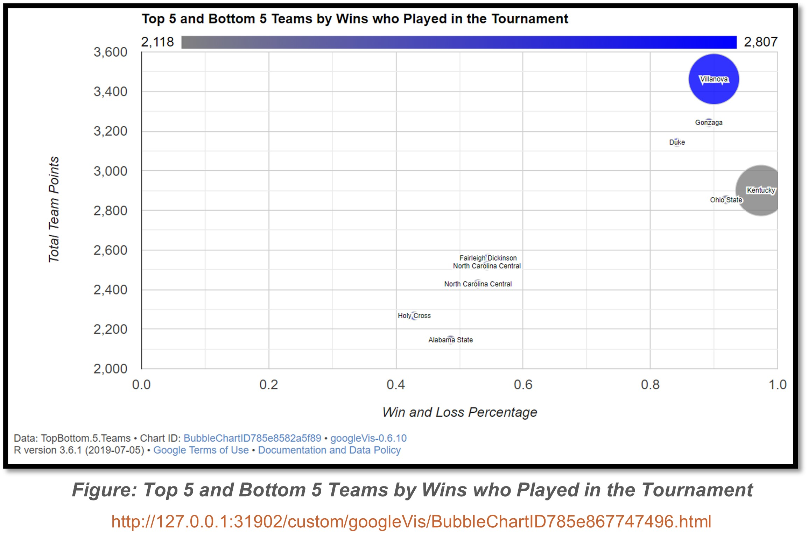

  
  
  

  
## **Modeling NCAA Basketball Champion Contenders**

&nbsp;

&nbsp;

{width=80%}

&nbsp;

[Source Code](NCAA_Project.html)

&nbsp;

{width=80%}

&nbsp;

{width=60%}

&nbsp;

  
##### **I conducted this analysis during my post grad course work in 2021 to test my R coding, data mining, data modeling, and data presentation skills.**

&nbsp;

##### **Purpose**
  + The purpose of this project was to scrape and use data from Sports Reference to create a supervised machine learning model that is trained and tested by the teams selected for the NCAA Basketball Championship Tournament. Analysis is supported with data visualizations to explain the methodologies.

##### **Abstract**
  + Every February millions of National Collegiate Athletic Association (NCAA) Basketball fans shut their doors to analyze player data, evaluations, and videos in hopes of filling in a perfect NCAA Basketball championship tournament bracket. Sports analysts create datasets based on individual player and team stats to make their selection in the tournament bracket. This study will make our own analytical assessment by web scraping and evaluating advanced NCAA basketball statistics over the past 10 years to build a supervised model and predict with a moderate degree of confidence the top teams for each season. The model will be trained using independent quantitative variables that are correlated to a factor result variable. We assess that teams located on the east coast with a win to lose rating between .8 and 1.0 and total points of over 2,800 over a season will have a strong chance at making the tournament championship and of high potential of making it to the Final Four teams. 

##### **Origin of Data**
  + This study evaluated the association between advanced correlated data for each NCAA basketball team to create a supervised model, train a dataset, and determine which teams have the highest success rate of making it to March Madness. We completed this entire study using R software. We scraped data for this study from the following two websites and R Document Dataset:

### **Presentation Slides**

##### **Sourcing**
  + Source 1 is a reputable sports analytics website that strives to work with respect, reliability, craftsmanship, and to promote the democratization of sports data. The date emphasized in red is the function variable that is used to scrape from multiple pages of advanced NCAA basketball data. Each season from source 1 lists all 354 NCAA division 1 tier schools and 37 independent quantitative variables. Additionally, we were able to obtain which teams made it to March Madness and the teams that made it to the Final Four for each season. We used Source 2 to scrape geographical data to identify the city and state for each Division 1 school.  We used Source 3 to include latitude and longitude data associated with each school’ city center. This study strived to minimize any hardcoding so future analysts can utilize the functions to scrape any number of seasons between the current year and 1991 from this website. Not all data used in this model is available prior to 1991.
  
  + 
Source 1 https://www.sports-reference.com/cbb/seasons/2021-advanced-school-stats.html

  + 
Source 2 https://www.ncsasports.org/mens-basketball/division-1-colleges

  + 
Source 3 R Document Dataset ‘us.cities’ from the Map Library

##### **Preparation of Data**
  + To meet the entire purpose of the project and test the model, we loaded 27 separate quantitative statistical variables for each of the 354 NCAA basketball teams. These are advanced data statistics over the entire season and this study chose to use the past 10 years of stats to create the model. This provided us with 3853 total observations to feed our supervised model. The primary dataset used in this study was scraped from Source 1 using a custom function called “Data.Scape.” 

  + Most data points obtained from this page were scraped from html nodes on each webpage. For each season, we were able to scrape two factor variables and 27 independent quantitative variables. These variables include:

  + The training and test data was also obtained from this website. After we inspected the source page, it was identified that an “NCAA” superscript text was placed next to each school that made the championship tournament.  Using the “stringR” library, we were able to strip this string from the team variable to create our  training factor variable. [Ln 33,34] 

  + We used the “p:nth-child” html element search function to locate on the source page the four teams that made it to the Final Four each season. After inspecting the data, we determined that the webpage used common school name acronyms such as “UCONN” for The University of Connecticut in this source paragraph.  This part of the function is the only hardcoded portion in the script. This was done so that these schools can be found in the primary dataset. [Ln 47-58]  Once this data was scraped, we then used an enclosed For Loop to evaluate the data and create our second training and testing factor variable that can be used for further modeling. After running multiple models ,we were unable to predict enough true positives with this training and testing variable. [Ln 60-67] 
  
##### **Analysis of Data**
  + Our modeling dataset with six independent variables provided us with a unique look into a team’s performance. Using the googleVis library and functions we created a bubble chart to show the relationship between the top 5 and bottom 5 teams that were selected to play in the championship tournament based on their Simple Rating System score. This rating not only takes into account points scored and allowed but the strength of the teams schedule. The plot represented a team’s Win and Loss percentage (x-axis), total points (y-axis), Total points allowed (color axis), and whether the team made it to the Final Four championship (size axis).  

##### **Data Modeling**
  + When preparing our data for our modeling function, we first normalized our independent variables for model efficiency. We then separate our entire primary dataset into two objects, training and testing. Our training object contains 70% of the data from the entire dataset. The testing object contains 30% of the data from the entire dataset. We then chose to use the K-nearest neighbors (K-NN) alrogithm technique to build our model. K-NN is a non-parametric classification method first developed by Evelyn Fix and Joseph Hodges in 1951. It is used for classification and regression. In both cases, the input consists of the k closest training examples in data set. The output depends on whether K-NN is used for classification or regression. In K-NN classification, the output is a class membership. An object is classified by a plurality vote of its neighbors, with the object being assigned to the class most common among its k nearest neighbors (k is a positive integer, typically small). If k = 1, then the object is simply assigned to the class of that single nearest neighbor. 

  + Before running our K-NN equation we first ran a Maximum Percentage Accuracy function to determine the best K value to use for our equation. The chart above maps out our results of possible K value. Based on the results of the function, it was determined that 24 was the best value for K. Running our K-NN model we were able to successful predict at a .8874 percent accuracy level 855 true negatives out of 939 observables and 75 out of 109 true positives in our tournament selectees training variable. 
  
##### **Conclusion**
  + This study was able to create a model at a .8874 accuracy rating to identify which teams will be selected to the NCAA championship tournament.  The study also showed that teams located on the East coast with a win to loss rating between .8 and 1.0 and total points of over 2,800 over a season to have high potential of making it to the Final Four teams. Even after all this statistical analysis, the NCAA Championship is called March Madness for a reason.  More than any other sport, college basketball is notorious for its surprises. From Florida in 2005-2006 to Butler in 2009-2010, each year teams seemingly come from nowhere to burst onto the national stage. Always consider the underdog and undervalued team when analyzing March Madness data.

&nbsp;

&nbsp;

&nbsp;

&nbsp;

&nbsp;

&nbsp;

&nbsp;

&nbsp;

&nbsp;

{width=95%}

&nbsp;

&nbsp;

&nbsp;

&nbsp;

&nbsp;

&nbsp;

{width=95%}

&nbsp;

&nbsp;

&nbsp;

{width=95%}

&nbsp;

&nbsp;

&nbsp;

{width=95%}

&nbsp;

{width=95%}

&nbsp;

{width=95%}

&nbsp;

{width=95%}

&nbsp;

{width=95%}

&nbsp;

{width=95%}

  
  
  
  
  
  