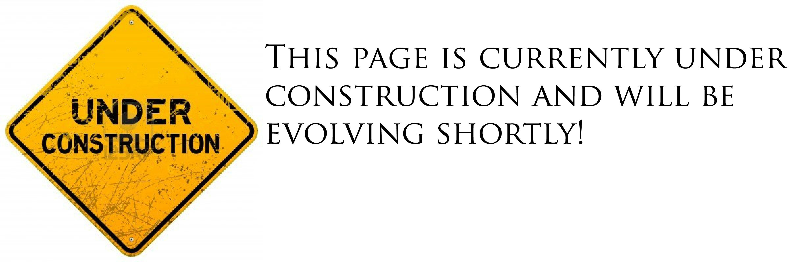

  

  

{width=100%}

  
&nbsp;

A work by <a href="https://github.com/Kusaf8/">Kevin Roberts</a>

<em>kevin.a.roberts8@gmail.com</em>

  
<link rel="stylesheet" href="https://cdnjs.cloudflare.com/ajax/libs/font-awesome/4.7.0/css/font-awesome.min.css">
  

  
&nbsp;

  