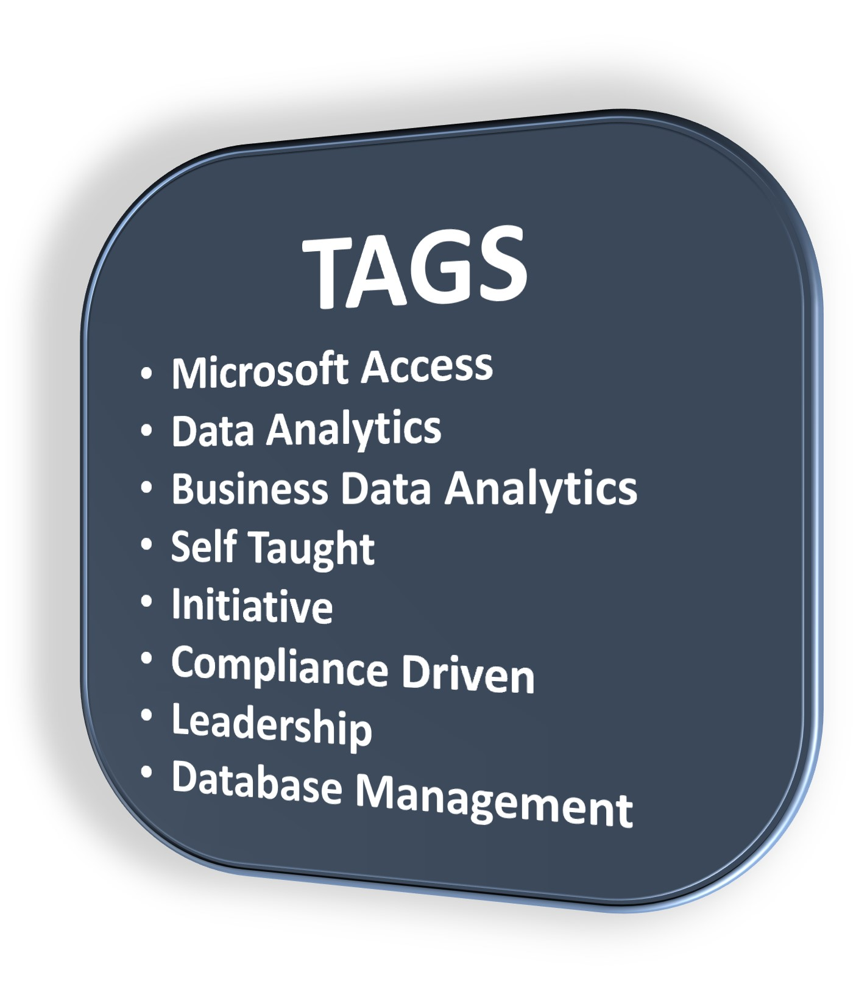
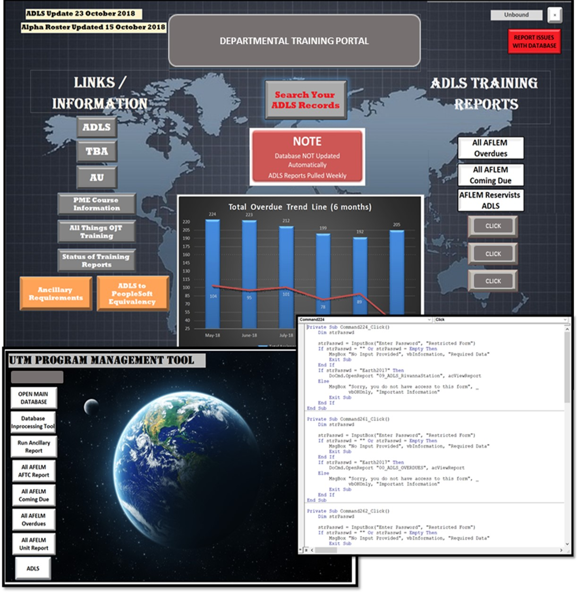

  
  
  

  

  
## **MICROSOFT ACCESS**

#### **Identified business need and developed database solution with a user-friendly tool to inform senior managers on department training compliance which increased compliance by 60%**

&nbsp;

Between 2015 and 2017, as a department training manager, one of my responsibilities was to oversee the training compliance of all 250 employees. My company hosted all trainings in an online portal which allowed each employee to take the training and see the history of completed courses. The online portal did not however provide any information as to when the employee was required to take the training again and it did not allow managers to see which employees complied with all required training. 

Using my self-taught skills, I quickly learned and created a relational database using Microsoft Access to extract data from the online portal, produce employee training compliance statistics using various graphical charts, and provide a user-friendly GUI to enable employees the ability to see real time when each required training was due. The access database featured action buttons, VBA coding and conditional formatting for report building.  I also built in a three-tier password protected user role architecture to maintain the security of the user.   

Microsoft Access is a great program for your data because it is affordable, easy to install, easy to use, and simple to integrate into your already established business architecture.  One of Accesses selling points is its large storage capacity where multiple users on a single application can store multiple GB’s of data. I desired to learn the functions of Access because of it’s simple importing function and backup solution options for your data.  With all these positive features, there are some downfalls to this software.  The biggest in my experience is it’s learning curve.  Understanding the systems relational design can be difficult for some users and formatting of forms and reports can become cumbersome.  If you are designing this system for your own work but plan on transferring it to another user or your successor, be aware that this software is not widely known.  Additionally, the one-file format which slows down the performance of the program and how easy a file can become corrupted if the database is shared with multiple users on different running Windows operating systems.  

By informing senior managers to further enforce this compliance and enabling employees to view their training status, this tool and database improved department training compliance by 60%. My department and company recognized and presented me a superior impact award in 2016 for this initiative.

&nbsp;

{width=60%}
 

&nbsp;

{width=95%}
  

