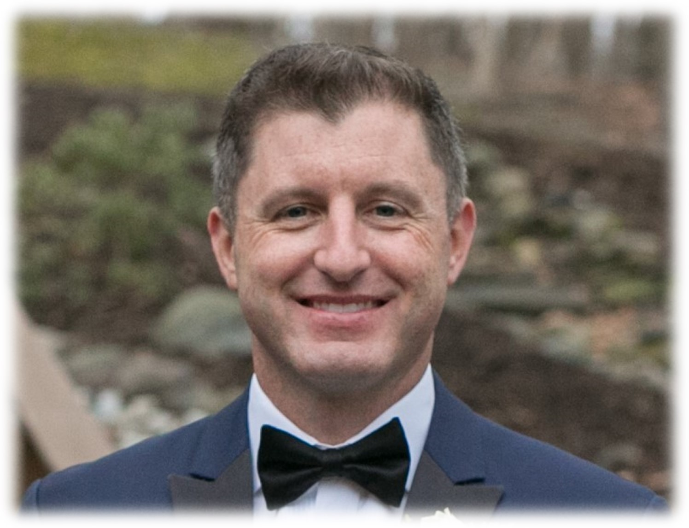
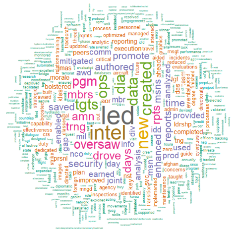
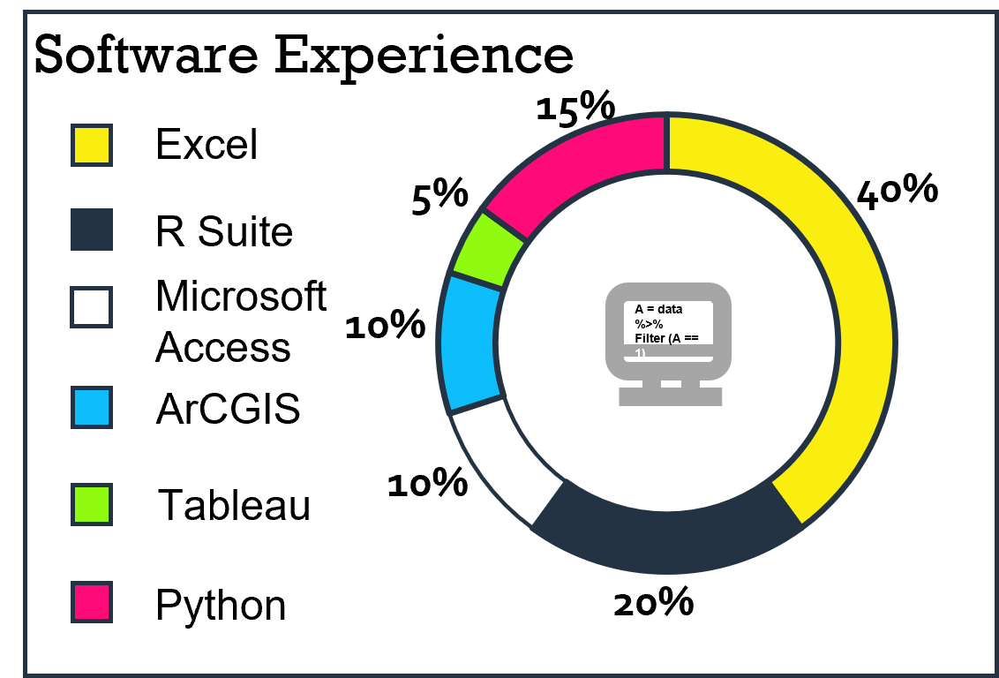

<style type="text/css">
.title {
  display: none;
}

getting-started img {
  margin-right: 10px;
}

</style>

<div class="row" style="padding-top: 30px;">
<div class="col-md-6">

<center>{width="70%"}</center>

<p>&nbsp;</p>
<p>&nbsp;</p>

<center>**Prominent Words of Past Performances**</center>

<p>&nbsp;</p>

<center>{width="90%"}</center>

<center>[Source Code](WordCloud.html)</center>

<p>&nbsp;</p>

*I created the above word cloud from my performance evaluations that span the past 10 years. This cloud represents a graphical representation of word frequency that give greater prominence to words that appeared more frequently in my evaluations.*

<p>&nbsp;</p>
<p>&nbsp;</p>

<center>{width="80%"}</center>

<p>&nbsp;</p>
<p>&nbsp;</p>

</div>
<div class="col-md-6">

## **Introduction**

Welcome to my site where I showcase most of my analytical works from my professional, academic, as well as my personal life as a hobby. Feel free to explore and I am always happy to chat about analytical tradecraft.

##### *Kevin Roberts*

##### *Senior Manager, Business Operations*

##### *Berlin, Germany*

### **Mission Statement:**

*Delivering Data Centric Solutions to Your Business Needs*

### **Quote**

*We all change when you think about. We are all different people all throughout our lives. That's alright, in fact that's good. You have to keep moving so long as you remember all the people who you used to be. - Dr. Who*

### **Summary**

I am a seasoned professional with a diverse work portfolio. Experience in aviation operations, intelligence operations at national level agencies, and business operations along with international relations as a U.S. Diplomat in Southwest Asia and Europe.

A flexible, adaptable employee that is quick to learn any type of new software. I can make the employer look good. Self-motivated, personnel-oriented, and decisive **leader**; adept at **revitalizing** operations, leading organization-wide campaigns, and capturing untapped potential in personnel. Accomplished and proven ability to communicate with business and technical audiences at all levels, including influencing senior leaders and decision-makers with efficient business solutions.

Successful history of proactively recognizing operational inefficiencies, then leading teams to **create** and **instill** data-centric solutions to improve processes that increase production.

### **Education**

#### Boston University

-   Graduate Certificate, Data Analytics (2020 - 2021)
-   Graduate Degree, Applied Data Analytics (2020 - est. 2024)

#### Park University

-   Bachelor of Applied Science, Computer/Information Technology (2005 - 2019)

#### Community College of the Air Force

-   Associate of Arts, Human Resources Management and Services (2018 - 2019)

#### Community College of the Air Force

-   Associate of Science, Intelligence Studies and Technologies (2011 - 2015)

#### Community College of the Air Force

-   Associate of Science, Aerospace Equipment Technologies (2002 -- 2005)

#### International Center for Language Studies

-   German Language (2019 - 2020)

#### Defense Intelligence Agency

-   Joint Military Attache School (2018)

#### U.S. Air Force Leadership Studies

-   Senior Leadership Academy (2015)
-   Leadership or Management Training (2006)

</div>
<div class="col-md-12">

<p>&nbsp;</p>
<p>&nbsp;</p>

<center>A work by <a href="https://github.com/Kusaf8/">Kevin Roberts</a></center>

<center>[<em>kevin.a.roberts8\@gmail.com](mailto:kevin.a.roberts8@gmail.com)</center>

<link rel="stylesheet" href="https://cdnjs.cloudflare.com/ajax/libs/font-awesome/4.7.0/css/font-awesome.min.css"></center>

<center><a href="http://www.linkedin.com/in/kevin-r-a4789a77" class="fa fa-linkedin"></a> <a href="https://github.com/Kusaf8/" class="fa fa-github"></a></center>

```{r, echo = FALSE}
count <- as.numeric(readLines("counter.txt")) 
count <- count + 1 
write(count, "counter.txt")

```
