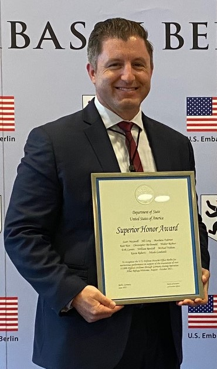

```{=html}
<style type="text/css">
.title {
  display: none;
}

getting-started img {
  margin-right: 10px;
}

</style>
```
<div class="row" style="padding-top: 30px;">

<p> </p>
<p> </p>

::: col-md-6
<center>{width="50%"}</center>

<p> </p>

<p> </p>

<center>**Prominent Words of Past Performances**</center>

<p> </p>

<center>{width="90%"}</center>

<p> </p>

*I created the above word cloud from my performance evaluations that span the past 10 years. This cloud represents a graphical representation of word frequency that give greater prominence to words that appeared more frequently in my evaluations.*

<p> </p>

<p> </p>

<center>{width="70%"}</center>

<p> </p>

<p> </p>
:::

::: col-md-6

## **Introduction**

Welcome to my site where I showcase most of my analytical works from my professional, academic, as well as my personal life as a hobby. Feel free to explore and I am always happy to chat about analytical tradecraft.
<p> </p>
### **Professional Title**
Kevin Roberts | Senior Manager, Business Operations | Berlin, Germany
<p> </p>
### **Professional Mission Statement:**

*Delivering Data Centric Solutions to Your Business Needs*
<p> </p>
### **Favorite Quote**

*We all change when you think about. We are all different people all throughout our lives. That's alright, in fact that's good. You have to keep moving so long as you remember all the people who you used to be. - Dr. Who*
<p> </p>
### **Bio Summary**

With over 21 years of experience on small teams and a post-graduate credential in data analytics from Boston University, I am a highly skilled professional with expertise in multiple areas.

I have excelled as both a U.S. diplomat in embassies abroad and an analyst with multiple national intelligence agencies. In both, I have led strategic-level operations and provided analytical expertise in the fields of geospatial, data science, and human intelligence to deliver analytic assessments to a wide range of customers.

I have eagerly undertaken multiple self-initiated quantitative business analytical studies to improve or eliminate manual processes. I have a curiosity and passion for problem solving. I will analyze business effectiveness, spot inefficiencies, and instill data-centric solutions. I am proactive and quick to learn new technologies to solve problems. When solutions are complex, I have the skills to verbally communicate these issues and solutions to diverse audiences.

<p> </p>
### **Education**

#### Boston University

-   Graduate Certificate, Data Analytics (2020 - 2021)
-   Graduate Degree, Applied Data Analytics (2020 - est. 2024)

#### Park University

-   Bachelor of Applied Science, Computer/Information Technology (2005 - 2019)

#### Community College of the Air Force

-   Associate of Arts, Human Resources Management and Services (2018 - 2019)

#### Community College of the Air Force

-   Associate of Science, Intelligence Studies and Technologies (2011 - 2015)

#### Community College of the Air Force

-   Associate of Science, Aerospace Equipment Technologies (2002 -- 2005)

#### International Center for Language Studies

-   German Language (2019 - 2020)

#### Defense Intelligence Agency

-   Joint Military Attache School (2018)

#### U.S. Air Force Leadership Studies

-   Senior Leadership Academy (2015)
-   Leadership or Management Training (2006)
:::

<div class="col-md-12">

<p> </p>

<p> </p>

<center>A work by <a href="https://github.com/Kusaf8/">Kevin Roberts</a></center>

<center><em>[kevin.a.roberts8\@gmail.com](mailto:kevin.a.roberts8@gmail.com)</center>

<link rel="stylesheet" href="https://cdnjs.cloudflare.com/ajax/libs/font-awesome/4.7.0/css/font-awesome.min.css">

</center>

<center><a href="http://www.linkedin.com/in/kevin-r-a4789a77" class="fa fa-linkedin"></a> <a href="https://github.com/Kusaf8/" class="fa fa-github"></a></center>
